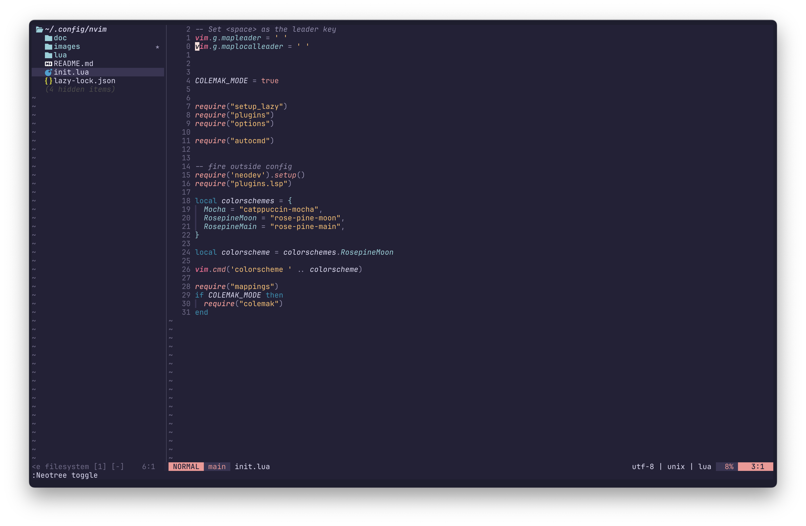

# My Neovim Configuration

Welcome to my personal Neovim configuration! This setup is tailored to enhance my productivity and coding experience.
It's was based on Tj's Kickstarter 

## Features

- **Colorscheme**: Rosé Pine Moon
- **Colemak DH Support**: Global variable for set motions remaps for Colemak DH Orth layout
- **Harpoon**: ThePrimeagen/harpoon for navigating large codebases blazingly fast
- **Lsp and usual stuff**: Language server, Lazy, completions, Neotree...
## Editor View

